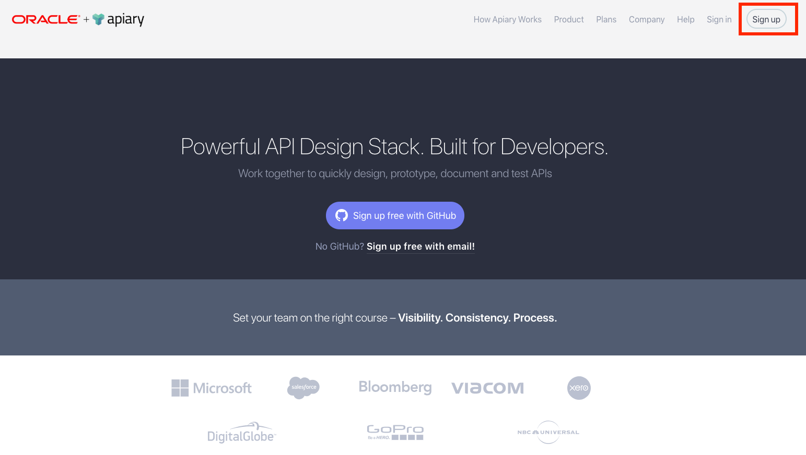
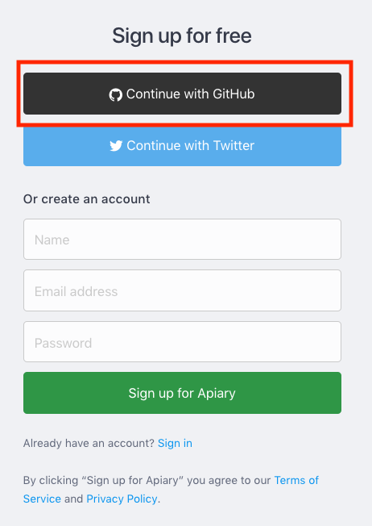
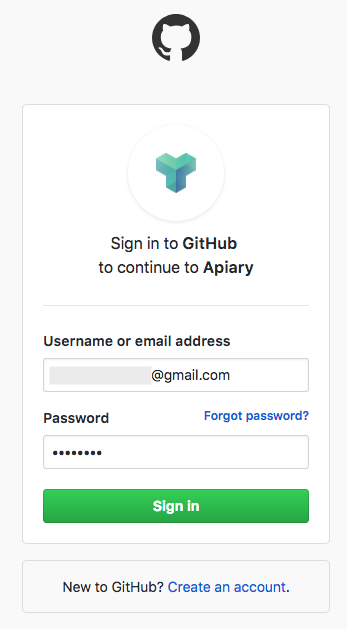
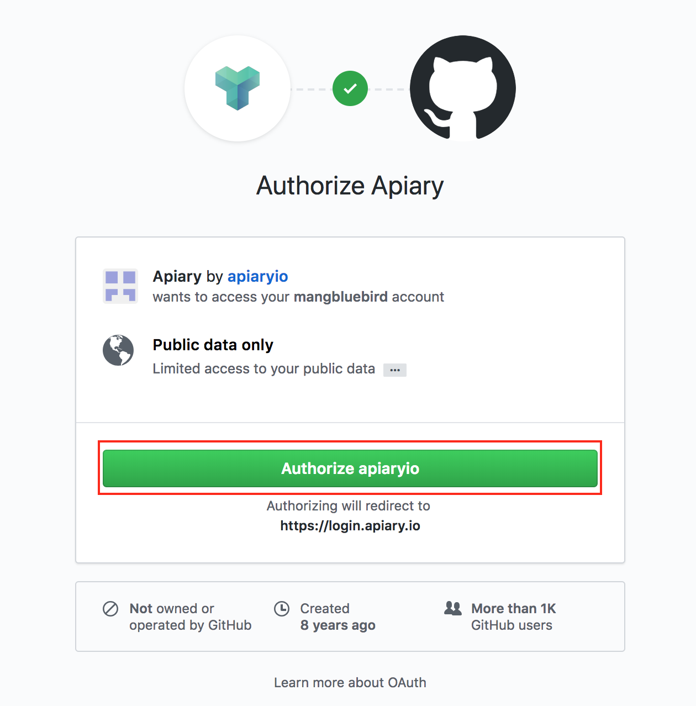
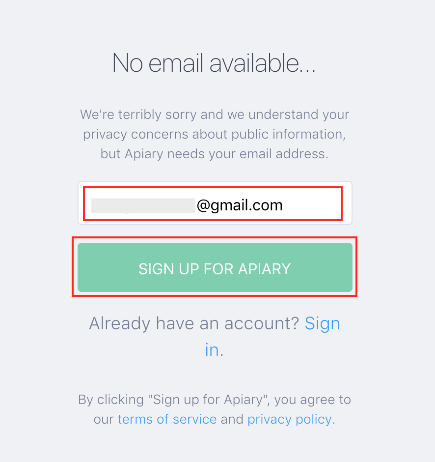
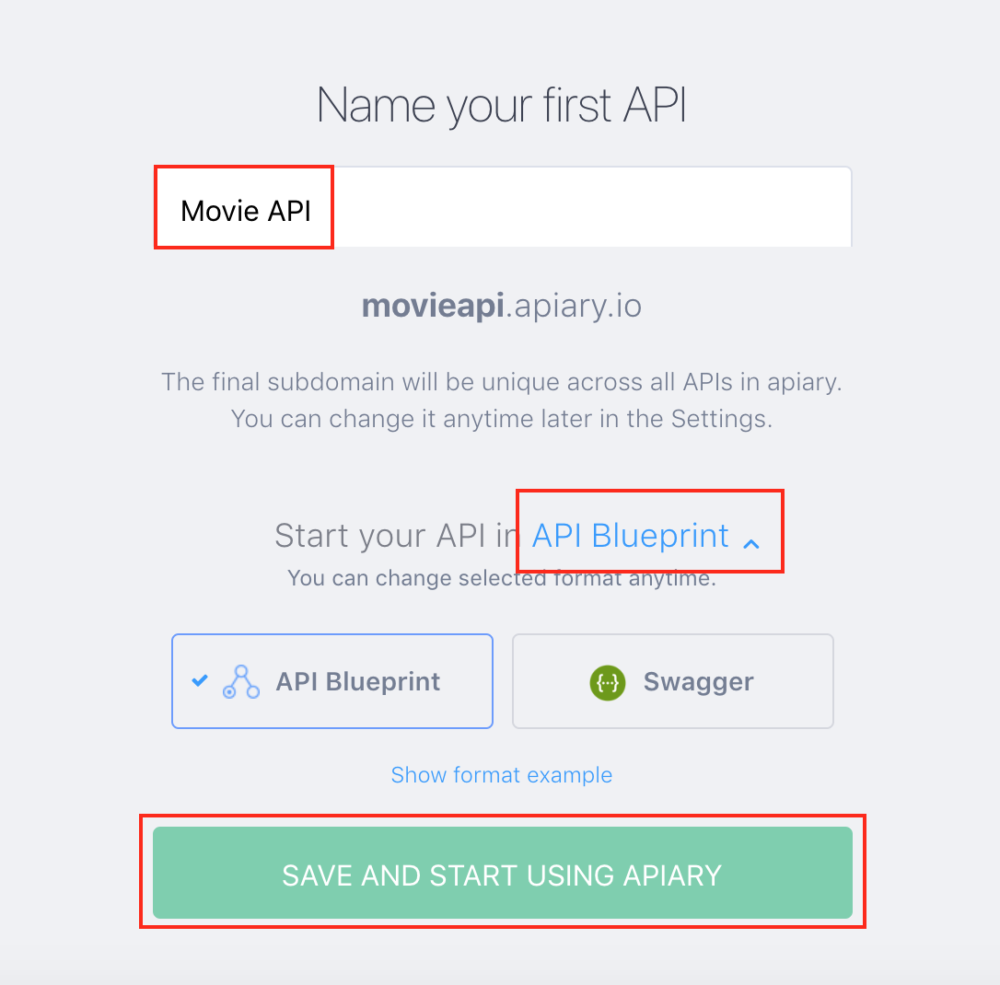
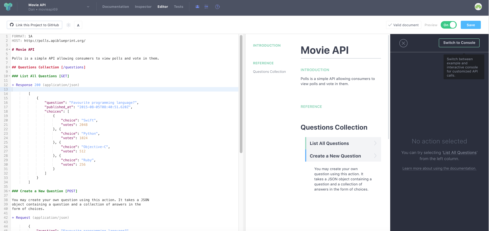
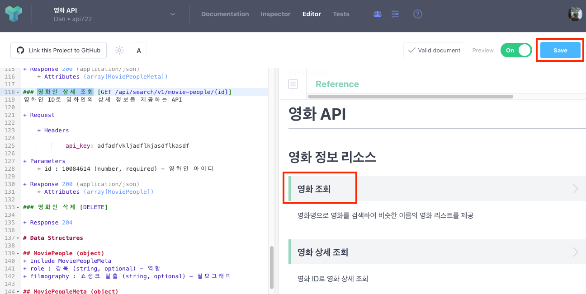

# [Hands-On] API design first & prototype

## API Blueprint Spec을 활용하여 API를 디자인 하고, Mock API와 API Gateway, Oracle JET을 활용하여 프로토타입 하는 것을 실습힙니다.

<details>
<summary>1. Apiary 계정 생성하기</summary>
API 설계 문서를 작성하고 Mock Test를 하기 위한 Apiary 계정을 생성하는 단계입니다.  
만약 계정을 가지고 있다면 이 단계를 건너뜁니다.  

> 1.1. [Apiary(https://apiary.io)](https://apiary.io) 홈페이지에 접속한 후 우측 상단의 **Sign up** 버튼을 클릭합니다.  
> 

> 1.2. **Continue with GitHub** 버튼을 클릭합니다.  
> 

> 1.3. GitHub 계정을 입력하고 **Sign In** 버튼을 클릭합니다.  
> 

> 1.4. Apiary에서 GitHub에 인증을 위한 권한을 요청합니다.  
> **Authorize apiaryio** 버튼을 클릭합니다.  
> 

> 1.5. Apiary에서 사용할 이메일을 입력합니다.  
> GitHub 이메일을 입력합니다.  
> 

> 1.6. Apiary 계정을 처음 만들면 기본 API 프로젝트 하나를 생성해야 합니다.  
> **Name your first API** 부분에 다음과 같이 *Movie API*를 입력하고 문서 타입은 API Blueprint로 선택합니다.  
> Apiary는 Swagger와 API Blueprint 두가지를 지원 합니다. (참고 -> [API Blueprint and Swagger](#api-blueprint-and-swagger)
> 

> 1.7. Apiary 계정과 첫 API Blueprint 프로젝트를 성공적으로 생성하였습니다. :clap:  
> 생성을 하게 되면 좌측에 샘플 API Blueprint 마크다운과 에디터가 보이고, 우측에 HTML 문서가 보입니다.  
> 
</details>

<details>
<summary>2. API Blueprint 설계 문서 작성하기</summary>

이제부터 Movie API 설계 문서를 작성합니다.  
> 2.1. 아래의 API Blueprint 코드를 복사해서 좌측 에디터의 샘플 Blueprint를 덮어 씁니다. 
>```markdown
>FORMAT: 1A
>HOST: http://polls.apiblueprint.org/
>
># 영화 API
>
>최근 인기있는 **영화 정보**와 관련 **영화인**에 대한 정보를 제공하는 API
>
># Group 영화 API
>
>## 영화 정보 리소스 []
>
>### 영화 조회 []
>영화명으로 영화를 검색하여 비슷한 이름의 영화 리스트를 제공
>
>+ Request
>
>    + Headers
>    
>             api_key: adfadfvkljadflkjasdflkasdf
>
>
>
>        
>+ Response 200 (application/json)
>
>         [
>             {
>                 "id": 278,
>                 "title": "쇼생크 탈출",
>                 "vote_count": 12728,
>                 "vote_average": 8.7,
>                 "poster_path": "/iZdih9zQAqxNadp0ScHyYRXsXLf.jpg",
>                 "release_date": "1995-01-28"
>             },
>             {
>                 "id": 238,
>                 "title": "대부",
>                 "vote_count": 9746,
>                 "vote_average": 8.6,
>                 "poster_path": "/cOwVs8eYA4G9ZQs7hIRSoiZr46Q.jpg",
>                 "release_date": "1972-12-27"
>             },
>             {
>                 "id": 129,
>                 "title": "센과 치히로의 행방불명",
>                 "vote_count": 7174,
>                 "vote_average": 8.5,
>                 "poster_path": "/mD49waY0XR7HNrS13r63tfgYT08.jpg",
>                 "release_date": "2002-06-28"
>             },
>             {
>                 "id": 424,
>                 "title": "쉰들러 리스트",
>                 "vote_count": 7746,
>                 "vote_average": 8.5,
>                 "poster_path": "/oyyUcGwLX7LTFS1pQbLrQpyzIyt.jpg",
>                 "release_date": "1994-03-05"
>             },
>             {
>                 "id": 550,
>                 "title": "파이트 클럽",
>                 "vote_count": 15870,
>                 "vote_average": 8.4,
>                 "poster_path": "/kabpExFv9JLp778w9ZtCtZnWH9N.jpg",
>                 "release_date": "1999-11-13"
>             }
>         ]
>
>### 영화 상세 조회 []
>영화 ID로 영화 상세 조회
>
>+ Request
>
>    + Headers
>    
>             api_key: adfadfvkljadflkjasdflkasdf
>    
>+ Parameters
>    + id : 278 (number, required) - 영화 아이디
>    
>+ Response 201 (application/json)
>
>    + Headers
>
>             Location: /api/v1/movie/278
>
>    + Body
>
>             {
>                 "id": 278,
>                 "title": "쇼생크 탈출",
>                 "vote_count": 12728,
>                 "vote_average": 8.7,
>                 "poster_path": "/iZdih9zQAqxNadp0ScHyYRXsXLf.jpg",
>                 "release_date": "1995-01-28"
>                 "overview": "촉망받는 은행 간부 앤디 듀프레인(팀 로빈슨)은 아내와 그녀의 정부를 살해했다는 누명을 쓴다. 주변의 증언과 살해 현장의 그럴듯한 증거들로 그는 종신형을 선고받고 악질범들만 수용한다는 지옥같은 교도소 쇼생크로 향한다. 인간 말종 쓰레기들만 모인 그곳에서 그는 이루 말할 수 없는 억압과 짐승보다 못한 취급을 당한다. 그러던 어느 날, 간수의 세금을 면제받게 해 준 덕분에 그는 일약 교도소의 비공식 회계사로 일하게 된다. 그 와중에 교도소 소장은 죄수들을 이리저리 부리면서 검은 돈을 긁어 모으고 앤디는 이 돈을 세탁하여 불려주면서 그의 돈을 관리하는데..."
>             }
>            
>
># Group 영화인 API
>## 영화인 정보 리소스 [/api/search/v1/movie-people]
>
>### 영화인 조회 [GET /api/search/v1/movie-people{?filmography}]
>필모 그래피로 영화인 정보를 검색하여 리스트를 제공
>
>+ Request
>
>    + Headers
>    
>             api_key: adfadfvkljadflkjasdflkasdf
>
>+ Parameters
>    + filmography : 쇼생크 (string, required) - 필모 그래피
>
>+ Response 200 (application/json)
>
>
>### 영화인 상세 조회 [GET /api/search/v1/movie-people/{id}]
>영화인 ID로 영화인의 상세 정보를 제공하는 API
>
>+ Request
>
>    + Headers
>    
>             api_key: adfadfvkljadflkjasdflkasdf
>
>+ Parameters
>    + id : 10084614 (number, required) - 영화인 아이디
>
>+ Response 200 (application/json)
>
>
>
>
>
>
>
>
>
>
>
>
>
>
>```

> 2.2. 위 API Blueprint문서를 붙여넣기 하고 아래 해당 라인에 비어있는 부분을 동일하게 입력합니다.
>```markdown
>10 : ## 영화 정보 리소스 [/api/search/v1/movies]
>
>12 : ### 영화 조회 [GET /api/search/v1/movies{?title}]
>
>21 : + Parameters
>22 :(탭 입력) + title : 대부 (string, optional) – 제목
>
>69 : ### 영화 상세 조회 [GET /api/search/v1/movies/{id}]
>
>133 : # Data Structures
>
>135 : ## MoviePeople (object)
>136 : + Include MoviePeopleMeta
>137 : + filmography : 쇼생크 탈출 (string, optional) - 필모그래피
>
>139 : ## MoviePeopleMeta (object)
>140 : + id : 10084614 (number, required) - 아이디
>141 : + name : 프랭크 다라본트 (string, required) – 이름
>142 : + role : 감독 (string, optional) - 역할
>
>116 :(탭 입력) + Attributes (array[MoviePeopleMeta])
>
>131 :(탭 입력) + Attributes (MoviePeople)
>```


> 2.3. 아래는 API Blueprint 완성본입니다.
>```markdown
>FORMAT: 1A
>HOST: http://polls.apiblueprint.org/
>
># 영화 API
>
>최근 인기있는 **영화 정보**와 관련 **영화인**에 대한 정보를 제공하는 API
>
># Group 영화 API
>
>## 영화 정보 리소스 [/api/search/v1/movies]
>
>### 영화 조회 [GET /api/search/v1/movies{?title}]
>영화명으로 영화를 검색하여 비슷한 이름의 영화 리스트를 제공
>
>+ Request
>
>    + Headers
>    
>             api_key: adfadfvkljadflkjasdflkasdf
>
>+ Parameters
>    + title : 대부 (string, optional) - 제목
>        
>+ Response 200 (application/json)
>
>         [
>             {
>                 "id": 278,
>                 "title": "쇼생크 탈출",
>                 "vote_count": 12728,
>                 "vote_average": 8.7,
>                 "poster_path": "/iZdih9zQAqxNadp0ScHyYRXsXLf.jpg",
>                 "release_date": "1995-01-28"
>             },
>             {
>                 "id": 238,
>                 "title": "대부",
>                 "vote_count": 9746,
>                 "vote_average": 8.6,
>                 "poster_path": "/cOwVs8eYA4G9ZQs7hIRSoiZr46Q.jpg",
>                 "release_date": "1972-12-27"
>             },
>             {
>                 "id": 129,
>                 "title": "센과 치히로의 행방불명",
>                 "vote_count": 7174,
>                 "vote_average": 8.5,
>                 "poster_path": "/mD49waY0XR7HNrS13r63tfgYT08.jpg",
>                 "release_date": "2002-06-28"
>             },
>             {
>                 "id": 424,
>                 "title": "쉰들러 리스트",
>                 "vote_count": 7746,
>                 "vote_average": 8.5,
>                 "poster_path": "/oyyUcGwLX7LTFS1pQbLrQpyzIyt.jpg",
>                 "release_date": "1994-03-05"
>             },
>             {
>                 "id": 550,
>                 "title": "파이트 클럽",
>                 "vote_count": 15870,
>                 "vote_average": 8.4,
>                 "poster_path": "/kabpExFv9JLp778w9ZtCtZnWH9N.jpg",
>                 "release_date": "1999-11-13"
>             }
>         ]
>
>### 영화 상세 조회 [GET /api/search/v1/movies/{id}]
>영화 ID로 영화 상세 조회
>
>+ Request
>
>    + Headers
>    
>             api_key: adfadfvkljadflkjasdflkasdf
>    
>+ Parameters
>    + id : 278 (number, required) - 영화 아이디
>    
>+ Response 201 (application/json)
>
>    + Headers
>
>             Location: /api/v1/movie/278
>
>    + Body
>
>             {
>                 "id": 278,
>                 "title": "쇼생크 탈출",
>                 "vote_count": 12728,
>                 "vote_average": 8.7,
>                 "poster_path": "/iZdih9zQAqxNadp0ScHyYRXsXLf.jpg",
>                 "release_date": "1995-01-28"
>                 "overview": "촉망받는 은행 간부 앤디 듀프레인(팀 로빈슨)은 아내와 그녀의 정부를 살해했다는 누명을 쓴다. 주변의 증언과 살해 현장의 그럴듯한 증거들로 그는 종신형을 선고받고 악질범들만 수용한다는 지옥같은 교도소 쇼생크로 향한다. 인간 말종 쓰레기들만 모인 그곳에서 그는 이루 말할 수 없는 억압과 짐승보다 못한 취급을 당한다. 그러던 어느 날, 간수의 세금을 면제받게 해 준 덕분에 그는 일약 교도소의 비공식 회계사로 일하게 된다. 그 와중에 교도소 소장은 죄수들을 이리저리 부리면서 검은 돈을 긁어 모으고 앤디는 이 돈을 세탁하여 불려주면서 그의 돈을 관리하는데..."
>             }
>            
>
># Group 영화인 API
>## 영화인 정보 리소스 [/api/search/v1/movie-people]
>
>### 영화인 조회 [GET /api/search/v1/movie-people{?filmography}]
>필모 그래피로 영화인 정보를 검색하여 리스트를 제공
>
>+ Request
>
>    + Headers
>    
>             api_key: adfadfvkljadflkjasdflkasdf
>
>+ Parameters
>    + filmography : 쇼생크 (string, required) - 필모 그래피
>
>+ Response 200 (application/json)
>    + Attributes (array[MoviePeopleMeta])
>
>### 영화인 상세 조회 [GET /api/search/v1/movie-people/{id}]
>영화인 ID로 영화인의 상세 정보를 제공하는 API
>
>+ Request
>
>    + Headers
>    
>             api_key: adfadfvkljadflkjasdflkasdf
>
>+ Parameters
>    + id : 10084614 (number, required) - 영화인 아이디
>
>+ Response 200 (application/json)
>    + Attributes (array[MoviePeople])
>
>
># Data Structures
>
>## MoviePeople (object)
>+ Include MoviePeopleMeta
>+ role : 감독 (string, optional) - 역할
>+ filmography : 쇼생크 탈출 (string, optional) - 필모그래피
>
>## MoviePeopleMeta (object)
>+ id : 10084614 (number, required) - 아이디
>+ name : 프랭크 다라본트 (string, required) - 이름
>
>```

> 2.3. 요청/응답 데이터 정의는 두 가지 유형을 보여주기 위해 JSON 형식과 [MSON](#mson) 형식으로 정의하였습니다.  
> 자동으로 변환된 HTML문서를 오른쪽 영역에서 볼 수 있습니다.  
> **영화 조회**, **영화 상세 조회**, **영화인 정보 리소스**, **영화인 상세 조회**를 클릭하여 각각의 서비스 URL, 요청 파리미터 및 JSON 응답, Mock URL을 확인할 수 있습니다. 
> 우측 상단의 Save 버튼을 클릭하여 저장합니다.  
> 
<details>
  
<details>
<summary>4. API Prototype 환경 구성하기</summary>
API Prototype을 위해서 Oracle JET 설치 환경을 구성합니다.  

먼저 깃헙 레파지토리를 다운로드 받아서 압축을 해제합니다.  

오라클 JET (UI) 프로젝트안으로 이동, 소스내 URL을 API Gateway의 Endpoint 확인  
아래 API 주소는 Oracle API Gateway의 주소입니다.  
jet-movie-msa-ui/src/js/endpoints.json
```
{
        "movies": "http://132.145.161.244:8011/api/search/v1/movies",
        "image": "https://image.tmdb.org/t/p/w185"
}
```

JET UI를 시작하기 위해서 Oracle JET CLI를 설치 후 다운로드 받은 jet-movie-msa-ui 폴더로 이동하여 node module을 설치합니다.
```
npm install -g @oracle/ojet-cli

cd jet-movie-msa-ui

npm install @oracle/oraclejet-tooling --save

ojet serve
```
</details>

  
  
  
